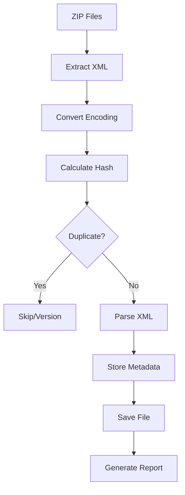

# 🏗️ Arquitetura do Sistema Inteligente de NFS-e

## 📋 Visão Geral

O Sistema Inteligente de NFS-e foi projetado seguindo os princípios de **Clean Architecture** e **Domain-Driven Design**, organizando o código em camadas bem definidas e com responsabilidades claras.

## 🎯 Princípios Arquiteturais

### **1. Separação de Responsabilidades**
- **API Layer**: Comunicação com APIs externas
- **Service Layer**: Lógica de negócio
- **Database Layer**: Persistência de dados
- **Models**: Estruturas de dados
- **Utils**: Funções utilitárias

### **2. Dependency Injection**
- Interfaces bem definidas
- Baixo acoplamento entre camadas
- Facilita testes unitários

### **3. Error Handling**
- Tratamento consistente de erros
- Logs estruturados
- Recuperação graceful

## 📁 Estrutura de Camadas

```
internal/
├── api/           # 🌐 Camada de API Externa
├── database/      # 🗄️ Camada de Persistência
├── models/        # 📊 Modelos de Dados
├── services/      # 🔧 Lógica de Negócio
└── utils/         # 🛠️ Utilitários
```

## 🌐 Camada de API (`internal/api/`)

### **Responsabilidades**
- Comunicação com APIs externas da Prefeitura Moderna
- Serialização/deserialização de dados
- Tratamento de erros de rede
- Rate limiting e retry logic

### **Componentes**
- **`nfse_client.go`**: Cliente principal da API NFS-e

### **Funcionalidades**
```go
// Consulta XML por período
func (c *NFSeClient) ConsultarXMLPorPeriodo(request models.ConsultaXMLRequest) (*models.NFSeXMLResponse, error)

// Consulta NFS-e individual
func (c *NFSeClient) ConsultarNFSeIndividual(numeroNFSe string) (*models.NFSeXMLResponse, error)

// Último RPS enviado
func (c *NFSeClient) UltimoRPSEnviado() (int, error)
```

## 🗄️ Camada de Persistência (`internal/database/`)

### **Responsabilidades**
- Operações CRUD no PostgreSQL
- Gerenciamento de conexões
- Transações e integridade
- Otimização de queries

### **Componentes**
- **`postgres.go`**: Implementação PostgreSQL

### **Funcionalidades**
```go
// Detecção de duplicatas
func (p *PostgresDB) CheckDuplicate(contentHash string) (*models.NFSeMetadata, error)

// Verificação de existência
func (p *PostgresDB) CheckNFSeExists(numeroNFSe, prestadorCNPJ, competencia string) (*models.NFSeMetadata, error)

// Armazenamento de metadados
func (p *PostgresDB) StoreMetadata(metadata *models.NFSeMetadata) error

// Logs de processamento
func (p *PostgresDB) LogProcessing(operation, sourceFile, status, message string, duration time.Duration) error
```

## 📊 Modelos de Dados (`internal/models/`)

### **Responsabilidades**
- Definição de estruturas de dados
- Validação de dados
- Serialização JSON/XML
- Métodos de formatação

### **Principais Modelos**
```go
// Metadados completos da NFS-e
type NFSeMetadata struct {
    ID                     int       `json:"id"`
    NumeroNFSe             string    `json:"numero_nfse"`
    ContentHash            string    `json:"content_hash"`
    PrestadorCNPJ          string    `json:"prestador_cnpj"`
    // ... outros campos
}

// Resposta da API
type NFSeXMLResponse struct {
    Success        bool          `json:"success"`
    RecordCount    int           `json:"RecordCount"`
    Dados          []NFSeXMLItem `json:"Dados"`
}

// Estrutura XML da NFS-e
type ConsultarNotaResponse struct {
    ListaNfse ListaNfse `xml:"ListaNfse"`
}
```

## 🔧 Lógica de Negócio (`internal/services/`)

### **Responsabilidades**
- Processamento inteligente de arquivos
- Detecção de duplicatas
- Versionamento automático
- Geração de relatórios

### **Componentes**
- **`organizer.go`**: Organizador inteligente

### **Fluxo de Processamento**


## 🛠️ Utilitários (`internal/utils/`)

### **Responsabilidades**
- Funções auxiliares reutilizáveis
- Conversões de dados
- Validações
- Formatação

### **Principais Funções**
```go
// Conversão de encoding
func ConvertToUTF8(data []byte) ([]byte, error)

// Formatação de competência
func FormatCompetencia(competencia string) (string, error)

// Parsing seguro
func ParseFloat(s string) float64
func ParseInt(s string) int

// Validações
func ValidateCNPJ(cnpj string) bool
func ValidateCPF(cpf string) bool
```

## 🔄 Fluxo de Dados

### **1. Consulta de NFS-e (Fetch)**
```
main.go → api.NFSeClient → API Externa → models.NFSeXMLResponse → Arquivos ZIP
```

### **2. Organização Inteligente (Organize)**
```
main.go → services.IntelligentOrganizer → database.PostgresDB → Estrutura Organizada
```

### **3. Detecção de Duplicatas**
```
ZIP File → Hash SHA256 → Database Check → Skip/Version/Process
```

## 🗃️ Schema do Banco de Dados

### **Tabelas Principais**
- **`nfse_metadata`**: Metadados completos das NFS-e
- **`processing_logs`**: Histórico de processamento
- **`prestador_cache`**: Cache de prestadores
- **`competencia_index`**: Índice por competência
- **`file_integrity`**: Integridade de arquivos

### **Relacionamentos**
```sql
nfse_metadata (1) ←→ (N) processing_logs
nfse_metadata (N) ←→ (1) prestador_cache
nfse_metadata (N) ←→ (1) competencia_index
```

### **Índices Otimizados**
- Hash de conteúdo (duplicatas)
- Número NFS-e + CNPJ + Competência (unicidade)
- Data de emissão (consultas temporais)
- CNPJ do prestador (agrupamentos)

## 🚀 Padrões de Design Utilizados

### **1. Repository Pattern**
```go
type MetadataRepository interface {
    CheckDuplicate(hash string) (*NFSeMetadata, error)
    StoreMetadata(metadata *NFSeMetadata) error
}
```

### **2. Factory Pattern**
```go
func NewNFSeClient(municipio, securityKey string) *NFSeClient
func NewIntelligentOrganizer(baseDir string, dbConfig DatabaseConfig) (*IntelligentOrganizer, error)
```

### **3. Strategy Pattern**
- Diferentes estratégias de processamento
- Conversão de encoding
- Formatação de dados

### **4. Observer Pattern**
- Logs de processamento
- Relatórios em tempo real
- Estatísticas de performance

## 🔒 Segurança e Confiabilidade

### **1. Integridade de Dados**
- Hash SHA256 para verificação
- Transações ACID no PostgreSQL
- Validação de dados de entrada

### **2. Tratamento de Erros**
- Recuperação graceful de falhas
- Logs detalhados de erros
- Continuidade de processamento

### **3. Performance**
- Connection pooling no PostgreSQL
- Processamento em lote
- Índices otimizados

## 📈 Monitoramento e Observabilidade

### **1. Logs Estruturados**
- Níveis de log apropriados
- Contexto detalhado
- Rastreabilidade de operações

### **2. Métricas**
- Taxa de processamento
- Duplicatas detectadas
- Performance de queries

### **3. Relatórios**
- Relatórios automáticos de processamento
- Estatísticas do banco de dados
- Dashboards via Adminer

## 🔮 Extensibilidade

### **1. Novos Municípios**
- Configuração via parâmetros
- Adaptação de endpoints
- Customização de parsing

### **2. Novos Formatos**
- Interface de conversores
- Plugins de processamento
- Extensão de modelos

### **3. Novas Funcionalidades**
- APIs REST para consulta
- Interface web administrativa
- Integração com outros sistemas

## 🎯 Benefícios da Arquitetura

### **1. Manutenibilidade**
- Código organizado e limpo
- Responsabilidades bem definidas
- Fácil localização de bugs

### **2. Testabilidade**
- Interfaces mockáveis
- Testes unitários isolados
- Testes de integração

### **3. Escalabilidade**
- Processamento paralelo
- Otimização de banco
- Arquitetura modular

### **4. Confiabilidade**
- Tratamento robusto de erros
- Recuperação automática
- Integridade de dados garantida
