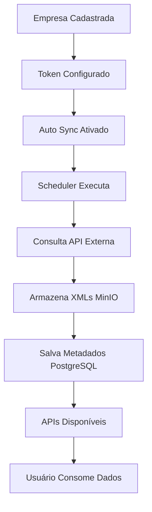

# 🛣️ ZoomXML Routes Module

## 📁 Estrutura Organizada de Rotas

Este módulo organiza todas as rotas da API ZoomXML de forma estruturada e modular.

### 📂 Arquivos

- **`routes.go`** - Configuração principal das rotas
- **`nfse_routes.go`** - Definições específicas de rotas NFS-e
- **`middleware.go`** - Middlewares específicos para rotas
- **`documentation.go`** - Documentação completa da API
- **`README.md`** - Este arquivo

## 🏗️ Arquitetura

### 1. **Configuração Modular**
```go
type RouteConfig struct {
    AuthService    *services.AuthService
    AuthHandler    *handlers.AuthHandler
    EmpresaHandler *handlers.EmpresaHandler
    NFSeHandlers   NFSeHandlers
}
```

### 2. **Middlewares Aplicados**
- ✅ **Rate Limiting** por tipo de operação
- ✅ **Security Headers** automáticos
- ✅ **Request Validation** 
- ✅ **Timeout Protection**
- ✅ **Compression** para respostas

### 3. **Grupos de Rotas**

#### 🔓 **Rotas Públicas**
- `GET /health` - Health check
- `POST /api/v1/auth/login` - Login
- `POST /api/v1/auth/logout` - Logout
- `POST /api/v1/auth/refresh` - Refresh token

#### 🔒 **Rotas Protegidas**
- `GET /api/v1/auth/me` - Info do usuário
- `CRUD /api/v1/empresas` - Gestão de empresas
- `NFS-e /api/v1/nfse/*` - Operações NFS-e

## 🚦 Rate Limiting

### Configuração por Tipo de Operação:

| Tipo | Limite | Descrição |
|------|--------|-----------|
| **Público** | 100/min | Rotas de autenticação |
| **Autenticado** | 1000/min | Operações gerais |
| **Operações Pesadas** | 10/min | Sync, bulk operations |
| **Downloads** | 50/min | Download de XMLs |

## 🔄 Funcionalidades Automáticas

### 1. **Consulta Automática de XMLs**
- ✅ Acionada por agendamento (cron)
- ✅ Configurável por empresa
- ✅ Múltiplas competências
- ✅ Retry automático

### 2. **Armazenamento Inteligente**
- ✅ Estrutura hierárquica no MinIO
- ✅ Metadados no PostgreSQL
- ✅ Detecção de duplicatas
- ✅ Versionamento

## 📊 Endpoints de Consumo

### **Listar XMLs Armazenados**
```http
GET /api/v1/nfse/xmls?page=1&per_page=20
Authorization: Bearer <token>
```

### **XMLs por Competência**
```http
GET /api/v1/nfse/xmls/2025-01
Authorization: Bearer <token>
```

### **Obter XML Específico**
```http
GET /api/v1/nfse/xml/2025-01/000001
Authorization: Bearer <token>
```

### **Download de XML**
```http
GET /api/v1/nfse/xml/2025-01/000001/download
Authorization: Bearer <token>
```

## 🔧 Como Usar

### 1. **No main.go:**
```go
// Setup routes using the organized route module
routeConfig := routes.RouteConfig{
    AuthService:    authService,
    AuthHandler:    authHandler,
    EmpresaHandler: empresaHandler,
    NFSeHandlers: routes.NFSeHandlers{
        HandleManualSync:            handleManualSync,
        HandleListJobs:              handleListJobs,
        HandleGetStats:              handleGetStats,
        HandleListStoredXMLs:        handleListStoredXMLs,
        HandleListXMLsByCompetencia: handleListXMLsByCompetencia,
        HandleGetStoredXML:          handleGetStoredXML,
        HandleDownloadXML:           handleDownloadXML,
    },
}

routes.SetupRoutes(app, routeConfig)
```

### 2. **Adicionar Nova Rota:**
```go
// Em routes.go
func setupCustomRoutes(protected fiber.Router, config RouteConfig, routeMiddleware *RouteMiddleware) {
    custom := protected.Group("/custom")
    custom.Get("/endpoint", routeMiddleware.ApplyCustomRateLimit(), customHandler)
}
```

## 🛡️ Segurança

### Headers Automáticos:
- `X-Content-Type-Options: nosniff`
- `X-Frame-Options: DENY`
- `X-XSS-Protection: 1; mode=block`
- `Referrer-Policy: strict-origin-when-cross-origin`
- `X-API-Version: 1.0.0`
- `X-Service: ZoomXML`

### Validações:
- ✅ Tamanho máximo de request (10MB)
- ✅ Content-Type validation
- ✅ Rate limiting por IP/usuário
- ✅ JWT token validation

## 📈 Monitoramento

### Métricas Disponíveis:
- ✅ Requests por endpoint
- ✅ Rate limiting hits
- ✅ Response times
- ✅ Error rates
- ✅ Download statistics

## 🚀 Benefícios

1. **Organização** - Código modular e fácil manutenção
2. **Segurança** - Rate limiting e validações automáticas
3. **Performance** - Middlewares otimizados
4. **Escalabilidade** - Estrutura preparada para crescimento
5. **Documentação** - API bem documentada
6. **Flexibilidade** - Fácil adição de novas rotas

## 🔄 Fluxo de Processamento



Este módulo de rotas garante que o sistema seja **robusto**, **seguro** e **fácil de usar**! 🎯
